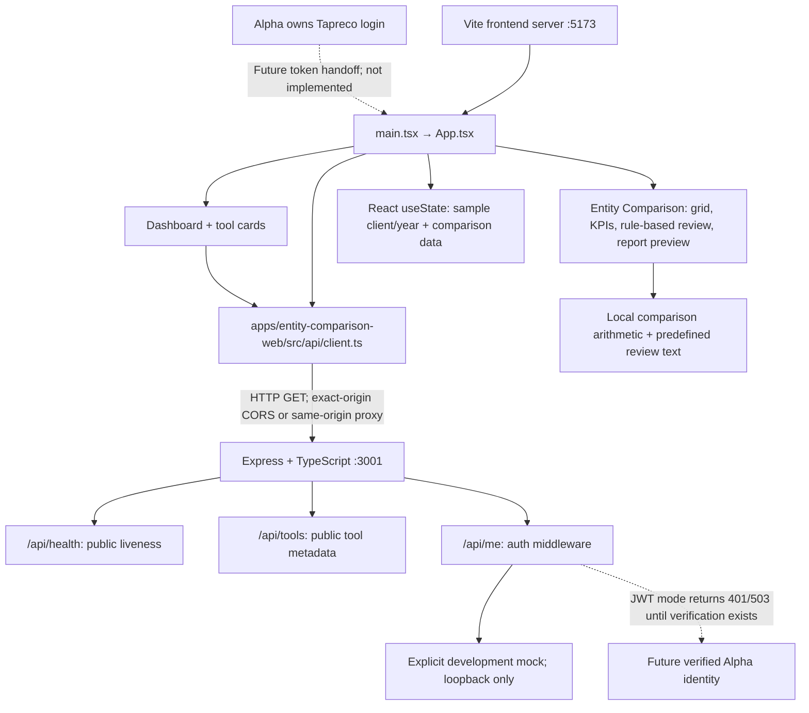

# Taxpreco Phase 1 architecture audit

Updated **6 October 2026** after the Phase 1 refactor and Entity Comparison package relocation. This replaces the earlier description of the broader browser workspace application.

## Current architecture

[Scalable diagram](docs/architecture.svg) · [Run and integration instructions](README.md) · [File/dependency changes](docs/PHASE1_REFACTOR.md)

## Repository layout

The frontend is an independent package in `apps/entity-comparison-web/`; its source, public assets, Playwright tests, Vite/TypeScript/ESLint configurations, environment example and lockfile live together. The Entity Comparison API is an independent package in `services/entity-comparison-api/`, including API tests and its own environment example and lockfile. Root `npm run dev` starts both packages using `concurrently`; the other root scripts forward to their respective packages. On a fresh checkout, `npm ci` installs the root development runner and `npm run setup` installs both child dependency sets.

Shared documentation remains at the root and in `docs/`. No Mutual Fund, tools API, Estimated Tax or Audit Risk files are modified. UI, business logic, tests and existing frontend/API dependency versions are preserved. The development frontend prefers port 5173 and automatically selects the next free port when occupied. See [the repository tree](README.md#structure).

`SERVE_FRONTEND=true` resolves `apps/entity-comparison-web/dist/` relative to the API module, in both source and compiled execution. API scripts load `services/entity-comparison-api/.env` through their package working directory; Vite loads `apps/entity-comparison-web/.env`.

## Ports and connections

| Surface | Local address / port | Connection |
| --- | --- | --- |
| Frontend | `http://localhost:5173` preferred | `strictPort: false`: automatically tries 5174, 5175 and subsequent available ports; use Vite's printed Local URL. |
| Backend | `http://localhost:3001` | Express, `PORT=3001` by default. Mock binds to loopback. |
| API | `/api/health`, `/api/tools`, `/api/me` | Same backend port, **3001**. |
| Build preview | `http://localhost:4173` | Static frontend preview; needs appropriate API base/CORS for this origin. |
| Browser test frontend | `http://127.0.0.1:5199` | Isolated Vite test server. |
| Browser test backend | `http://127.0.0.1:3002` | Isolated real Express API, exact-origin test CORS. |
| Database | None | No database service or database port. |
| Production | Hosting-dependent | Build artifacts are ready; public URLs/TLS are not configured or deployed. |

Without a frontend environment override, requests use `/api`; Vite proxies them to local port 3001. This same-origin connection, including the identity endpoint, works when Vite selects an alternate frontend port without widening backend CORS. `VITE_API_BASE_URL` can instead name a browser-safe API origin; direct requests require the actual frontend origin in `TAPRECO_ALLOWED_ORIGIN`. Production same-origin hosting uses an empty base and `SERVE_FRONTEND=true`; separate hosting requires the actual public API origin at frontend build time.

Only one Vite config exists in this checkout: `apps/entity-comparison-web/vite.config.ts`. The preview's strict port 4173 and Playwright's explicit strict test port 5199 remain intentional and unchanged. The app uses hash navigation and has no configured login redirects tied to port 5173. No real `.env` files are present; both environment examples are preserved. The architecture images show the preferred frontend port; the table above describes the current automatic selection behavior.

## Files and responsibilities

| Boundary | Source | Responsibility |
| --- | --- | --- |
| Composition | [apps/entity-comparison-web/src/App.tsx](apps/entity-comparison-web/src/App.tsx) | Navigation, selected sample client/year, comparison state, report dialog, initial API checks. |
| Dashboard | [apps/entity-comparison-web/src/components/dashboard](apps/entity-comparison-web/src/components/dashboard) | Entity Comparison card from the API catalog, with an offline sample catalog. |
| Comparison | [apps/entity-comparison-web/src/components/entity-comparison](apps/entity-comparison-web/src/components/entity-comparison) | Preserved approved UI, assumptions, estimates, KPI/chart presentation, rule-based review, preview. |
| Browser API | [apps/entity-comparison-web/src/api/client.ts](apps/entity-comparison-web/src/api/client.ts) | Three small GET functions and an optional bearer-token argument. |
| Sample contracts | [apps/entity-comparison-web/src/types](apps/entity-comparison-web/src/types), [apps/entity-comparison-web/src/data](apps/entity-comparison-web/src/data) | Small typed demo records; no persistent workspace schema. |
| Calculation | [apps/entity-comparison-web/src/utils/comparison.ts](apps/entity-comparison-web/src/utils/comparison.ts) | Differences and net benefits from supplied taxes/costs; predefined insight text. |
| Backend | [services/entity-comparison-api/src/app.ts](services/entity-comparison-api/src/app.ts), [services/entity-comparison-api/src/index.ts](services/entity-comparison-api/src/index.ts) | Express API and optional static frontend hosting. |
| Environment/auth | [services/entity-comparison-api/src/config.ts](services/entity-comparison-api/src/config.ts), [services/entity-comparison-api/src/middleware/auth.ts](services/entity-comparison-api/src/middleware/auth.ts) | Exact-origin configuration, loopback development mock restrictions, fail-closed future JWT boundary. |

## Data and authentication boundaries

Frontend demo state contains shared inputs, scenarios, notes, observations, selected review insights and selected report sections. It exists only in React memory. Refresh or client/year selection resets it to illustrative values. Navigating between dashboard/tool and switching tabs retains current in-memory edits.

No localStorage, backups, document uploads/parsing, PDF downloads, tax planner, advanced structures, server persistence or database is active. Previous browser workspace data is not read or deleted. The previous audit's persistence findings no longer apply to the Phase 1 runtime because those code paths were removed.

Alpha owns login. `/api/me` returns a visibly fake identity only in local development mock mode. Mock startup outside development/test or on a non-loopback host is rejected. JWT mode returns **401** without a bearer token and **503** with one until a real verifier is implemented. Even populated JWT environment settings do not authorize access today. Health success only proves service liveness.

`/api/tools`, the dashboard and navigation expose **Entity Comparison only** for Phase 1. No additional tool entries or placeholder cards are included.

## Verified scope

- Frontend and backend TypeScript/build checks and ESLint are required.
- API tests cover metadata, mock identity, CORS/preflight, rejected unverified tokens and invalid mock startup configuration.
- Browser tests cover dashboard/tool navigation, live API use, sample edits and reset behavior, tabs, report preview/dialog accessibility, outage fallback, and 1440/1024/768/390 px layouts.
- React, React DOM, Vite, TypeScript, React plugin and Playwright resolved versions are retained. ExcelJS, PDF.js and jsPDF are removed with their unused workflows.

## Remaining integration work

Alpha must supply the expected issuer, audience, JWKS URL, allowed frontend origin and token-handoff contract. Implement server-side cryptographic verification and authorization before protected production use. Choose actual hosting URLs and configure HTTPS. Persistent storage, a tax engine, AI service, full document/report workflows and advanced structures remain separate future phases.

## Development startup verification

The root command targets the only frontend in this checkout and starts it together with its integration API. No other application entrypoint, workspace tooling, shared UI package or duplicate Vite configuration was found. No repository restructure or tax-calculation changes were needed.

The development strict-port setting was the cause of the reported startup error. Verified root startup on available IPv4 port 5173, automatic fallback to 5174 when 5173 was occupied, and fallback to 5175 when both preferred ports were occupied. The existing IPv6 5173 application was left running throughout. The same-origin proxy successfully served health, tool catalog and identity requests at every selected port; Chrome verified the connected dashboard and Entity Comparison at the fallback URL.

Frontend and API builds include successful TypeScript checks. ESLint, all 6 API tests and all 5 existing browser tests passed. Ctrl+C stopped the test services and the owned temporary listener.
