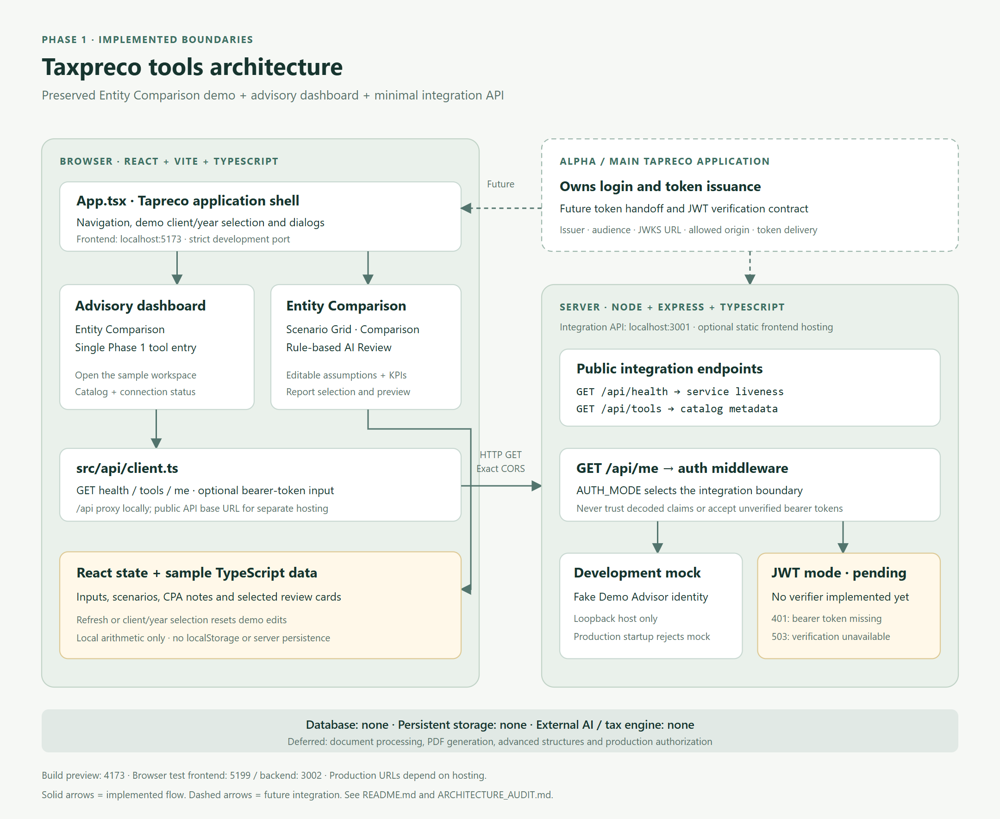
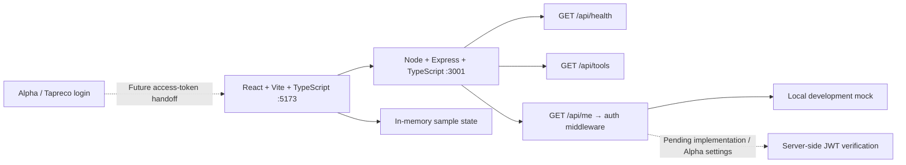

# Tapreco professional tools — Phase 1

Phase 1 preserves the approved Entity Savings demo and adds a dashboard plus a small integration API. Alpha owns the main Tapreco login. This repository does not create a second login platform or a database.

## Run locally

Use Node.js **24+** and npm. The frontend and API have independent packages and lockfiles. The root package coordinates development with `concurrently` and forwards the other commands. On a fresh checkout, install the root development runner and both package dependency sets:

```sh
npm ci
npm run setup
```

Start the frontend and API together from the repository root in one terminal:

```sh
npm run dev
```

Open the **Local** URL printed by Vite. It prefers **http://localhost:5173** and automatically tries **5174**, **5175**, and the next available port when needed. The API runs at **http://localhost:3001**. Development auth is explicitly labeled **DEVELOPMENT MOCK**, with a fake Demo Advisor identity and a loopback-only backend listener.

No port override or second terminal is needed. Press **Ctrl+C** to stop the services started by this command. `concurrently` stops its companion command if either service exits; it does not terminate unrelated applications. The API retains its configured port; an occupied API port produces its normal startup error.

The default relative `/api` proxy works on every selected frontend port, including `/api/me`; the browser makes same-origin requests and backend CORS remains restricted to its configured origin. For an explicitly configured direct `VITE_API_BASE_URL`, set `TAPRECO_ALLOWED_ORIGIN` to the exact frontend origin or use the relative proxy for automatic frontend port selection. No login redirect URL is configured in this demo.

The existing `npm run dev:server` is still available for API-only development. `npm run dev:frontend` starts only Vite and accepts frontend options, for example `npm run dev:frontend -- --host 127.0.0.1`. The root `dev` command executes `concurrently --kill-others --names API,WEB "npm run dev:server" "npm run dev:frontend"`.

No `.env` files are required for the local demo. The frontend uses Vite's `/api` proxy by default. For custom settings, use [apps/entity-comparison-web/.env.example](apps/entity-comparison-web/.env.example) and [services/entity-comparison-api/.env.example](services/entity-comparison-api/.env.example) as templates for ignored `.env` files in those same package directories. Only examples are included in the repository. The API scripts load its package-local `.env`; Vite loads the frontend package-local `.env`.

```sh
npm run build          # Frontend -> apps/entity-comparison-web/dist/
npm run build:server   # Backend -> services/entity-comparison-api/dist/
npm run lint
npm run test:api
npm run test:e2e
```

Browser tests start isolated servers on frontend **5199** and backend **3002**. They refuse to reuse existing servers. Windows uses installed Chrome; on other platforms run `npx playwright install chromium` from `apps/entity-comparison-web/`.

You can also run `npm ci` and package scripts directly inside either package directory. The API package exposes `dev`, `build`, `start`, `lint`, and `test`; the frontend exposes `dev`, `build`, `preview`, `lint`, and `test:e2e`. No npm workspaces are used, so these commands do not install or modify other tools.

`npm run preview` runs at **4173** and serves frontend build output only. For that separate origin, build with `VITE_API_BASE_URL` set to the API origin and set `TAPRECO_ALLOWED_ORIGIN=http://localhost:4173` on the backend, or use the same-origin build described below. The development proxy applies to `npm run dev`, not a separately hosted build.

## PHASE 1 ARCHITECTURE



[Scalable SVG](docs/architecture.svg) · [Detailed architecture audit](ARCHITECTURE_AUDIT.md) · [Refactor report](docs/PHASE1_REFACTOR.md)



### Frontend

- Professional dashboard with **Entity Comparison only**. Navigation and the API catalog expose this single Phase 1 tool.
- Preserved Tapreco shell, sidebar/mobile navigation, client/year selectors and illustrative-data badge.
- Entity Savings retains Scenario Grid, Comparison and AI Review; shared inputs, editable assumptions, sample current/S/C scenarios, scenario additions, tax-estimate editing, KPI cards, bars, review checkboxes and CPA notes.
- The report modal retains section/scenario selection and a live preview. **PDF generation is deferred**; no fake download is offered.
- State uses `useState` and props. No localStorage is read or written. Refresh, client selection or year selection resets the sample inputs; tab/navigation changes keep current in-memory edits. Years are demo context, not tax-rule versions.
- `apps/entity-comparison-web/src/api/client.ts` calls all three endpoints. Catalog fallback allows the demo to run when the API is offline. Its optional bearer-token argument is the future host integration boundary; the current demo does not receive or store Alpha tokens.

### Backend and API

The API exposes public health/catalog metadata and an identity endpoint with a separate auth middleware. It does not persist client records or calculate taxes.

| Endpoint | Phase 1 behavior |
| --- | --- |
| `GET /api/health` | `{"status":"ok","service":"taxpreco-tools"}`. Service liveness only, not proof that JWT integration works. |
| `GET /api/tools` | Metadata for Entity Comparison only, with `enabled: true` and `availability: "demo"`. |
| `GET /api/me` | In local mock mode, a fake Demo Advisor identity with `mode: "mock"`. JWT mode returns 401 without a bearer token, or 503 until verification is implemented. |

Verification URLs:

```text
http://localhost:3001/api/health
http://localhost:3001/api/tools
http://localhost:3001/api/me
```

### Authentication / Alpha integration

Alpha owns sign-in and token issuance. **Real JWT verification is not implemented yet.** `services/entity-comparison-api/src/middleware/auth.ts` is the integration boundary; it never trusts decoded claims and never converts a verification failure into a mock identity.

- The development script opts into development mode. Missing `AUTH_MODE` then selects the labeled mock identity.
- `AUTH_MODE=mock` is rejected outside `NODE_ENV=development` or `test`, and mock listeners must use a loopback host.
- The compiled start command defaults to production behavior. Missing production CORS configuration fails startup; missing JWT settings leaves protected access unavailable.
- `AUTH_MODE=jwt` requires a bearer header but accepts **no token** today. Supplying issuer/audience/JWKS values alone does not turn on verification.
- Server-side signature verification, expected issuer/audience, expiry handling and authorization must be implemented before protected production use.

Alpha will need to confirm:

| Setting / contract | Purpose |
| --- | --- |
| `TAPRECO_JWT_ISSUER` | Expected issuer supplied by Alpha. |
| `TAPRECO_JWT_AUDIENCE` | Intended token audience for these tools. |
| `TAPRECO_JWKS_URL` | Alpha's public key discovery endpoint. |
| `TAPRECO_ALLOWED_ORIGIN` | Exact browser origin allowed by the API. No wildcard. |
| `VITE_API_BASE_URL` | Public API origin for a separately hosted frontend; empty for same-origin hosting. This is build-time browser configuration. |
| Token handoff | How the host supplies a short-lived access token, then sends `Authorization: Bearer ...`. No URL-query or persistent browser-token flow is implemented. |
| Token claims / algorithms | Which verified claims and allowed algorithms define the eventual access policy. |

JWT signing secrets/private keys never belong in React or `VITE_*` variables. CORS restricts browser response access; it is not authentication or authorization. See the [official Express CORS documentation](https://expressjs.com/en/resources/middleware/cors/).

### Hosting-ready output

The project has buildable frontend/backend output; no hosting provider or deployment URL has been chosen, and this refactor does not deploy anything.

For a same-origin deployment, leave `VITE_API_BASE_URL` empty when building the frontend, build both packages, then configure the server using hosting environment variables:

```text
NODE_ENV=production
AUTH_MODE=jwt
HOST=0.0.0.0
PORT=<hosting platform port>
TAPRECO_ALLOWED_ORIGIN=https://<actual frontend host>
SERVE_FRONTEND=true
```

Then start it with `npm run start:server`. Express serves `apps/entity-comparison-web/dist/` assets and `/api` from one origin. Keep the sibling `apps/` and `services/` layout when using this static-hosting mode. Hash navigation requires no rewrite rules. These placeholders are deployment settings, not working credentials or supplied Alpha values. The public sample UI, health and catalog can be hosted while `/api/me` remains unavailable until verification exists.

For separate frontend/API hosting, publish `apps/entity-comparison-web/dist/` on the frontend host, set its actual API origin at build time, and configure backend CORS to match the actual frontend origin. Use HTTPS hosting configuration rather than local URLs. Alpha can also integrate the tool through its main host once the navigation/token contract is agreed.

### Database and storage

**Database: none in Phase 1.** No separate authentication database, ORM, migrations, cloud object storage, browser workspace backups or persistent server storage are implemented. Old browser workspace data is neither loaded nor cleared by this refactor.

### Calculation boundary

All taxes are illustrative sample figures or advisor-entered assumptions. Income, salary, retirement, dividends, state and ownership changes do not run a tax engine.

```text
Tax difference = baseline tax estimate - alternative tax estimate
Annual net benefit = tax difference - (alternative admin costs - baseline admin costs)
First-year net benefit = annual net benefit - alternative transition costs
```

AI Review is a deterministic rule-based review. State tax, QSBS, reasonable compensation and tax liability require separate analysis.

### Future work

Real Alpha JWT verification and production authorization; a persistent database if required; a validated tax engine; external AI; document-processing workflows; full reports; and advanced structures are deferred.

### Structure

```text
taxpreco/
|-- apps/
|   `-- entity-comparison-web/
|       |-- src/                  React UI, demo data, comparison math, API client
|       |-- public/               Favicon
|       |-- tests/                Preserved Playwright workflows
|       |-- .env.example
|       |-- package.json
|       |-- package-lock.json
|       |-- index.html
|       |-- vite.config.ts
|       |-- playwright.config.ts
|       |-- eslint.config.js
|       `-- tsconfig*.json
|-- services/
|   `-- entity-comparison-api/
|       |-- src/                  Startup, configuration, routes, auth middleware
|       |-- tests/                Preserved API / CORS / auth tests
|       |-- .env.example
|       |-- package.json
|       |-- package-lock.json
|       |-- eslint.config.js
|       `-- tsconfig.json
|-- docs/
|-- ARCHITECTURE_AUDIT.md
|-- README.md
|-- package.json                  Development runner and command forwarders
|-- package-lock.json
`-- .gitignore
```

This checkout contains Entity Comparison only. The local Mutual Fund branch reference has `apps/mutual-fund-web/` and `services/tools-api/`; this structural refactor does not import or modify them. Entity Comparison follows that independent-package layout and retains its own API service, without merging into the PostgreSQL-based tools API.
